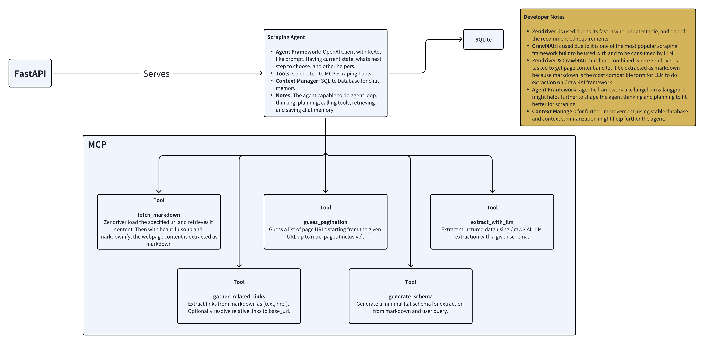

# Scraper Agent

LLM-assisted web scraping agent with:
- Markdown fetching via headless browser
- LLM-generated minimal schema
- LLM-guided extraction (Crawl4AI)
- Simple agent loop with planning, pagination, and link following
- FastAPI HTTP API and local MCP server

## Architecture

## Repository layout

- [main.py](main.py) — minimal end-to-end demo (fetch → schema → extract → print).
- [api.py](api.py) — FastAPI app exposing a single `/chat` endpoint that runs the agent and persists state.
- [mcp_server.py](mcp_server.py) — local MCP server exposing scraping tools over stdio for MCP clients.
- [scraper_agent/](scraper_agent)
  - [web.py](scraper_agent/web.py)
    - [`scraper_agent.web.fetch_markdown`](scraper_agent/web.py): fetches a URL with zendriver and returns markdown.
    - [`scraper_agent.web.extract_markdown_links`](scraper_agent/web.py): parses markdown links as (text, href).
  - [schema.py](scraper_agent/schema.py)
    - [`scraper_agent.schema.generate_schema`](scraper_agent/schema.py): uses an LLM to propose a minimal flat schema mapping field -> str|int|float|bool.
  - [extract.py](scraper_agent/extract.py)
    - [`scraper_agent.extract.extract_with_llm`](scraper_agent/extract.py): runs Crawl4AI LLM extraction using a provided schema.
  - [crawl.py](scraper_agent/crawl.py)
    - [`scraper_agent.crawl.guess_next_page_urls`](scraper_agent/crawl.py): heuristic pagination URL generator.
    - [`scraper_agent.crawl.gather_related_links`](scraper_agent/crawl.py): filters and deduplicates related links from markdown.
  - [db.py](scraper_agent/db.py) — lightweight SQLite persistence for sessions, messages, and results.
  - [types.py](scraper_agent/types.py) — [`scraper_agent.types.ExtractResult`](scraper_agent/types.py) container for extraction outputs.
  - [__init__.py](scraper_agent/__init__.py) — package exports.
- [agent.py](agent.py)
  - [`run_agent`](agent.py): main agent loop (planning and tool orchestration).
  - Planner helpers:
    - [`llm_decide_next`](agent.py): choose next action: extract | paginate | follow | stop.
    - [`llm_decide_followup`](agent.py): choose reuse vs crawl based on memory/prior items.
    - [`transform_prior_items_with_llm`](agent.py): post-process prior items per prompt.
- [requirements.txt](requirements.txt) — pinned dependencies.
- [.env.example](.env.example) — example environment variables.

## Requirements

- Python 3.10+
- A compatible OpenAI-style API key (set in `.env`)
  - OPENAI-compatible deployments supported via `OPENAI_BASE_URL` (optional)

## Setup

1) Create and activate a virtual environment (recommended):
- Windows (PowerShell):
  - `python -m venv .venv`
  - `.venv\Scripts\Activate.ps1`
- macOS/Linux (bash):
  - `python3 -m venv .venv`
  - `source .venv/bin/activate`

2) Install dependencies:
- `pip install -r requirements.txt`

3) Configure environment:
- Copy [.env.example](.env.example) to `.env` and set:
  - `LLM_PROVIDER` (default: `openai/gpt-4o-mini`)
  - `OPENAI_API_KEY`
  - optional: `OPENAI_BASE_URL` for non-OpenAI gateways
  - optional: `SCRAPER_AGENT_DB` for SQLite path (defaults to `sessions.sqlite`)

Notes:
- Windows: subprocess-based tools (used by Crawl4AI) are enabled via Proactor loop policy in [api.py](api.py) and [scraper_agent/extract.py](scraper_agent/extract.py).

## Run the API server

Start FastAPI with uvicorn:
- `uvicorn api:app --reload --host 0.0.0.0 --port 8000`

Open the interactive docs:
- Swagger UI: http://localhost:8000/docs
- ReDoc: http://localhost:8000/redoc

### API: /chat

- Method: POST
- Path: `/chat`
- Request model: [`ChatRequest`](api.py)
  - `url: str` — starting URL
  - `user_prompt: str` — instruction, e.g. “list jobs with role, location, pay”
  - `max_pages: int | None` — optional pagination cap
  - `max_iterations: int | None` — optional agent step cap
  - `session_id: str` — session key for persistence
- Response model: [`ChatResponse`](api.py)
  - `text: str` — summary
  - `results: list[Any]` — structured items
  - `schema: dict | None` — inferred schema
  - `visited_count: int | None` — visited pages

Example request (curl):
- `curl -X POST http://localhost:8000/chat -H "Content-Type: application/json" -d "{\"url\":\"https://example.com\",\"user_prompt\":\"Extract titles and links\",\"session_id\":\"demo-1\"}"`

## Run the MCP server (local)

- The MCP server is designed to run locally and communicate over stdio with an MCP client (e.g., in an IDE).
- Start:
  - `python mcp_server.py`
- Tools exposed:
  - [`tool_fetch_markdown`](mcp_server.py) → [`scraper_agent.web.fetch_markdown`](scraper_agent/web.py)
  - [`tool_generate_schema`](mcp_server.py) → [`scraper_agent.schema.generate_schema`](scraper_agent/schema.py)
  - [`tool_extract_with_llm`](mcp_server.py) → [`scraper_agent.extract.extract_with_llm`](scraper_agent/extract.py)
  - [`tool_guess_pagination`](mcp_server.py) → [`scraper_agent.crawl.guess_next_page_urls`](scraper_agent/crawl.py)
  - [`tool_gather_related_links`](mcp_server.py) → [`scraper_agent.crawl.gather_related_links`](scraper_agent/crawl.py)

Note:
- This repository connects the MCP server directly in the same environment as the scraping code for simplicity. It does not spin up a separate remote MCP service by default.

## How it works (high level)

1) Fetch page as markdown:
   - [`scraper_agent.web.fetch_markdown`](scraper_agent/web.py)
2) Propose minimal flat schema:
   - [`scraper_agent.schema.generate_schema`](scraper_agent/schema.py)
3) Extract items using schema:
   - [`scraper_agent.extract.extract_with_llm`](scraper_agent/extract.py)
4) Agent loop for planning and traversal:
   - [`run_agent`](agent.py) uses planning helpers to paginate/follow/extract.

## Examples

You may look for further test cases, results, curls, responses, and screenshoots under the `examples` directory.

## Tips

- If extraction returns strings instead of arrays, parse JSON before use (see [main.py](main.py)).
- Tweak `LLM_PROVIDER` and temperature via environment to control verbosity and cost.
- On Windows CI/servers, Proactor loop policy is already handled in [api.py](api.py) and [scraper_agent/extract.py](scraper_agent/extract.py).
- The provided max_pages and max_iterations parameters as a guardrails to make sure that the system is within the LLM limitations (e.g. token per minutes) and to make sure that the agent always returns instead of getting infinite loop if infinite loop happens
- gpt-4o-mini is used for development and testing, and it is already running well and as intended, but it is suggested to use a smarter and larger model as well.
- Further developer notes, tips, explanation can be seen under the architecture image above.